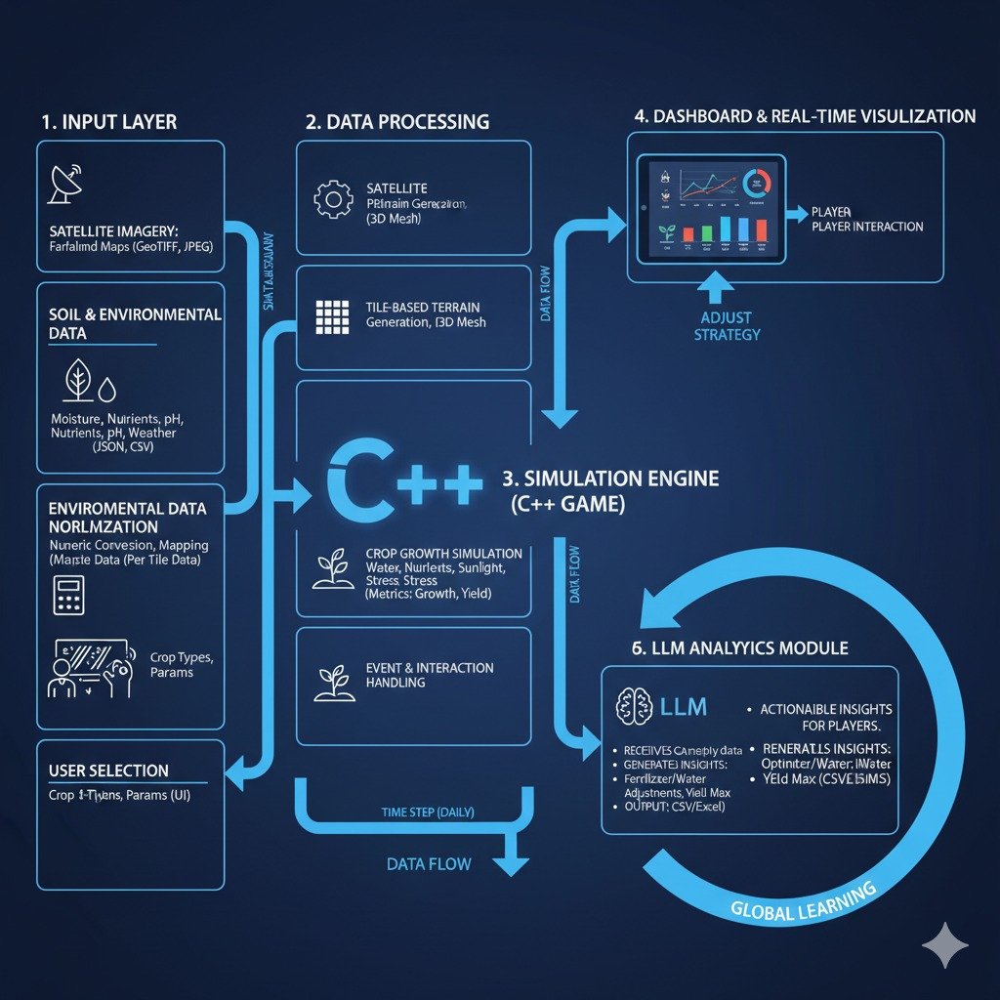

# 🌾 Harvestor  

Harvestor is a **farm simulation project** built with **C++** and **SFML**.  
It simulates farmlands, ponds, and crops under varying environmental conditions such as rainfall, soil quality, and water distribution.  

The project offers both a **visual simulation** (interactive graphics) and a **data-driven experiment** (Python Dash reports), making it suitable for **educational, research, and gaming extensions**.  

---

## 🔎 Project Overview  

- **Core Concept**  
  - Farmlands are divided into tiles where crops can be planted.  
  - Each crop’s growth depends on soil fertility, water availability, nutrients, and environment.  
  - Simulations show how conditions impact crop health and yield.  

- **Visualization Features**  
  - Crops grow dynamically on the farm grid.  
  - Color-coded feedback for crop health and growth stage.  
  - Rainfall, ponds, and soil factors influence outcomes.  
  - Dashboard (Python Dash) for detailed analytics and reporting.  

---

## 🛠️ Requirements  

- **C++17 or later**  
- [SFML 2.5+](https://www.sfml-dev.org/)  
- **CMake** (for building)  
- **Python 3** + [Dash](https://dash.plotly.com/) (for dashboard reports)  

---

## ⚡ Installation & Execution  

```bash
# Clone repository
git clone https://github.com/your-username/Harvestor.git
cd Harvestor

# Build and Execution
./run.sh
```
---

## ⚡ Quick Start Usage Example

Once the simulation is running, you can interact with your farm using the UI:

1. **Load a Farm Layout**  
   - Click **Load Layout** to populate the farm with lands and ponds.  
   - Crops are automatically planted on all lands.

2. **Select Crop Type (Optional)**  
   - Use the **Crop Dropdown** to select a crop type.  
   - All crops will update their color to match the selected type.

3. **Select Area & Plant Crops**  
   - Use **Select Area** to choose a region of interest.  
   - Click **Plant Crops** to plant the selected crop in the chosen area.

4. **Start Simulation**  
   - Click **Simulate** to begin growth.  
   - Crops grow over time depending on soil quality, water availability, and rainfall.  
   - Ponds and rain events automatically influence water distribution.

5. **Monitor Growth**  
   - Crop tiles scale visually and change color as they grow.  
   - Fully grown crops are highlighted, and maturity time is recorded.

6. **Submit Results**  
   - Click **Submit** to save the simulation data.  
   - The data is used for further analysis.

7. **Analysis**  
   - Click **Analyse** to view a detailed report of the simulation.  
   - Opens an HTML dashboard summarizing growth metrics and statistics.

8. **Reset**  
   - Click **Reset** to clear crop growth and water levels.  
   - The farm layout remains intact for a new simulation run.


---

## Architecture




